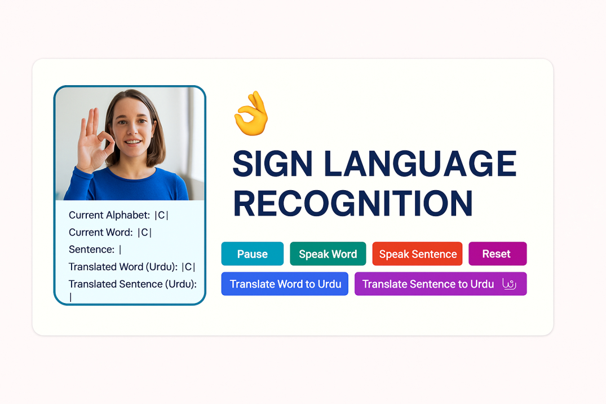

# 🤟 Real-Time Sign Language Recognition Web App

This is a real-time Sign Language Recognition web app that uses **Mediapipe**, a **Conv1D deep learning model**, and **Flask** to recognize American Sign Language (ASL) hand signs via webcam. The app provides predictions in real time and allows users to form **words and sentences**. It also supports **English-to-Urdu translation** and **speech synthesis** using Text-to-Speech (TTS).

---

## ✨ Features

- 📷 Real-time webcam feed for live ASL sign recognition
- 🤖 Conv1D model trained on (42,1) hand landmark vectors from Mediapipe
- 🔤 Displays **Current Alphabet**, **Current Word**, and **Current Sentence**
- 🎤 Speak the current word or sentence using `pyttsx3` TTS
- 🌐 Translate word or sentence from **English to Urdu**
- 🎛️ Reset predictions or pause/resume live recognition
- 🌙 Light/Dark mode ready (in UI)
- 📱 Responsive UI for desktop & mobile
- 🔄 Clear prediction when no hand is detected

## 🧠 Model Details

- Model: Conv1D-based sequential model trained on ASL A-Z + space + nothing
- Input Shape: (42, 1) — extracted from 21 Mediapipe hand landmarks (x, y)

---

## 📁 Folder Structure
* ├── app.py                         # Main Flask app
* ├── templates/
* │   └── index1.html               # Frontend HTML
* ├── static/
* │   └── style1.css                # CSS styling
* ├── model/
* │   └── optimized_asl_model.keras # Trained ASL model
* ├── main.py                       # Optional script (if used for training or testing)

## 🖥️ App Usage
✋ Show a hand sign from A-Z in front of the webcam.

🔡 Watch Current Alphabet, Word, and Sentence update in real time.

🗣️ Click Speak Word or Speak Sentence to hear TTS.

🌐 Click Translate to Urdu to see Urdu translation.

🔄 Use Reset to clear the text buffer.

⏸️ Use Pause/Resume to stop/start live prediction.

## 📄 License 
you are free to use, modify, and share this project.

## 🙌 Acknowledgments
Mediapipe by Google

TensorFlow

pyttsx3

Google Translate API

## 💬 Connect
If you like this project or want to contribute, feel free to fork, star, and send a pull request!
